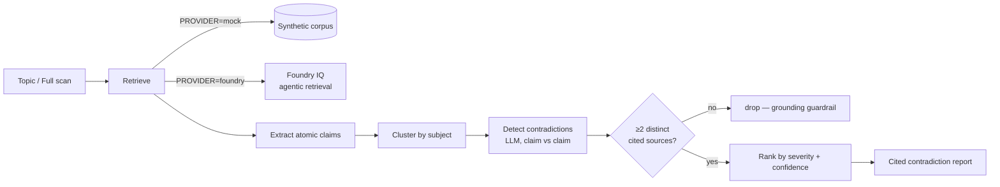

# ⚖️ Crosscheck — Enterprise Knowledge Contradiction Auditor

> **Find where your sources disagree.**
> A reasoning agent that audits a body of enterprise knowledge and surfaces the
> *contradictions* between authoritative documents — citing both sides, classifying
> the clash, and ranking by severity.

**Microsoft Agents League Hackathon** · Track: **🧠 Reasoning Agents** · Tool:
**Microsoft Foundry** · IQ layer: **Foundry IQ**

---

## The problem

Ordinary RAG answers a question from **one** retrieved passage. If two of your
documents quietly disagree — a security policy says rotate passwords every 90 days
while the onboarding guide says they never expire — RAG grounds in whichever one it
happened to fetch and answers *confidently and wrong*. The contradiction is invisible.

That silent disagreement is the root cause of untrustworthy enterprise agents.

## What Crosscheck does

Crosscheck does the **inverse of RAG**. Instead of answering, it audits:

1. Retrieves passages **across many sources** (via Foundry IQ).
2. Extracts atomic, normalized **claims**.
3. **Clusters** claims by subject and detects **contradictions** between sources.
4. Emits a ranked **Contradiction Report** — each conflict shows both claims, **both
   citations**, the conflict *type*, a *severity*, a *confidence*, and a clearly-labelled
   *suggested resolution*.

It refuses to assert a contradiction it can't prove: **no conflict is emitted without two
citations from two different source documents.**

A built-in **conflict map** turns the result into a picture — each source document is a node,
each contradiction an arc colored by severity and weighted by confidence — so you can see the
shape of disagreement at a glance and click any arc to jump to its details.

> _Run it and open the live UI — a dark, enterprise-grade dashboard with an animated reasoning
> trace, summary stats, severity filters, an interactive conflict map, and side-by-side cited
> conflict cards._
<!-- Add a screenshot at docs/screenshot.png and embed it here for the submission. -->

### Interface

The UI is a single-page app (no build step — Tailwind via CDN) designed to feel like an
enterprise audit console rather than a chatbot:

- **Palette:** deep navy base with an electric-blue primary and amber/red severity accents.
- **Icons:** all inline SVG (no emojis) for a crisp, professional look.
- **Reasoning trace:** each step slides in and resolves to a check as the agent works.
- **Conflict map:** a radial node-link graph — nodes are source documents, arcs are
  contradictions (colour = severity, thickness = confidence); click an arc to jump to its card.
- **Conflict cards:** side-by-side cited claims with a `VS` divider, severity + type tags,
  a confidence bar, and a clearly-labelled suggested resolution.
- **Setup panel:** live status of provider / LLM / Foundry IQ access with next-step guidance.

---

## Run it in 60 seconds (no cloud needed)

```powershell
py -3.13 -m venv .venv
.\.venv\Scripts\python.exe -m pip install -r requirements.txt
.\.venv\Scripts\python.exe -m uvicorn backend.app:app --port 8000
```

Open <http://127.0.0.1:8000>, type a topic (e.g. **password policy**, **refund window**,
**API rate limit**) or hit **Full scan**. With no credentials it runs in **offline demo**
mode over a bundled cached report, so the UI always works.

> If port 8000 is unavailable on your machine, pick another — e.g. `--port 8080` — and open
> the matching URL.

- **Add live reasoning:** put `AZURE_OPENAI_*` (or `OPENAI_API_KEY`) in `.env` — the engine
  now extracts claims and detects contradictions with an LLM over the synthetic corpus.
- **Add real Foundry IQ:** check access (`./infra/check_access.ps1`), provision +
  upload the bundled corpus (`./infra/setup_foundry_iq.ps1`), create the knowledge base, then
  set `PROVIDER=foundry`. Citations now resolve to a real Foundry IQ knowledge base.

> **"My Azure is empty — how do I validate?"** That's expected. Crosscheck brings its own data:
> `setup_foundry_iq.ps1` uploads `corpus/` for you, and the knowledge base is built over it. The
> in-app **Setup & access** panel (and `GET /api/setup-status`) shows live, step-by-step what is
> wired up and what to do next — Step 0, surfaced inside the app.

---

## How it works



The **knowledge-retrieval boundary** ([`providers/base.py`](backend/providers/base.py)) makes
the reasoning engine identical whether passages come from the local
[`MockProvider`](backend/providers/mock_provider.py) or the real
[`FoundryIQProvider`](backend/providers/foundry_provider.py). The two reasoning steps live in
[`reasoning/pipeline.py`](backend/reasoning/pipeline.py) with prompts in
[`reasoning/prompts.py`](backend/reasoning/prompts.py).

### Foundry IQ integration (the required Microsoft IQ layer)

`FoundryIQProvider` calls a **Foundry IQ knowledge base** through Azure AI Search
**agentic retrieval**: the knowledge base decomposes the query into parallel subqueries
across its knowledge sources, semantically reranks, enforces permissions, and returns
**extractive content with references**. That multi-source, *cited* grounding is exactly what
Crosscheck needs to find a contradiction and prove it. Setup: [`infra/README.md`](infra/README.md).

### Reliability & safety

- **Grounding guardrail** — a contradiction needs two claims from two *different* sources;
  unsupported candidates are dropped.
- Every claim and conflict side carries a `SourceRef` (document · section · version · date).
- **Suggested resolutions are labelled as suggestions**, with the heuristic shown (higher
  authority, else more recent) — never asserted as truth.
- Deterministic ranking; graceful "no contradictions found"; auto-fallback to the cached
  report if a live LLM call fails — the demo never hard-crashes.
- The bundled corpus is **synthetic** — no confidential data (per the hackathon Disclaimer).

---

## Project structure

```
backend/
  app.py                 FastAPI: serves the SPA + POST /api/scan
  config.py  models.py   settings + pydantic domain models
  providers/             KnowledgeProvider boundary: mock + Foundry IQ
  reasoning/             pipeline, LLM client, prompts
corpus/                  8 synthetic sources with planted contradictions
web/                     single-page UI (index.html + app.js)
samples/cached_report.json   offline demo / test oracle
infra/                   Azure provisioning + Foundry IQ setup guide
UPGRADE_BACKLOG.md       queued enhancements (see roadmap below)
```

## Status &amp; roadmap

**Built and working today:**

- End-to-end audit pipeline: retrieve → extract claims → cluster → detect contradictions →
  rank, with a live animated reasoning trace.
- Pluggable knowledge-retrieval boundary (mock corpus by default; Foundry IQ via config).
- Grounding guardrail (no conflict without two citations from two different sources).
- Revamped enterprise-grade UI: navy/electric-blue palette, all-SVG icons (no emojis),
  interactive radial conflict map, severity filters, side-by-side cited conflict cards, and a
  live setup/access panel.
- Offline demo mode that never hard-crashes (cached-report fallback).

**Queued upgrades** (tracked in [`UPGRADE_BACKLOG.md`](UPGRADE_BACKLOG.md)):

| # | Upgrade | Why it matters | Cloud needed |
| - | ------- | -------------- | ------------ |
| 1 | Verifier / critic agent step | Makes reasoning visibly multi-step; challenges and prunes weak conflicts | No |
| 2 | Resolution-drafting agent | Drafts corrected policy text, not just a heuristic suggestion | No |
| 3 | Live document upload | Audit your own docs on the spot — stronger demo than a fixed corpus | No |
| 4 | Real Foundry IQ knowledge base | Targets the "Best Use of IQ Tools" prize | Yes (Azure) |

## How it maps to the rubric

| Criterion | Where |
| --- | --- |
| Accuracy & relevance | Reasoning track + Foundry IQ; every output cited |
| Reasoning & multi-step | retrieve → extract → cluster → detect → rank, visible in the trace |
| Creativity & originality | inverts RAG: finds disagreements, not answers |
| UX & presentation | enterprise dashboard: animated trace, interactive conflict map, severity filters, side-by-side cited cards, all-SVG icons |
| Reliability & safety | 2-source guardrail, labelled suggestions, graceful fallback |

## License

MIT — see [LICENSE](LICENSE). Demo corpus is fictional and for demonstration only.
